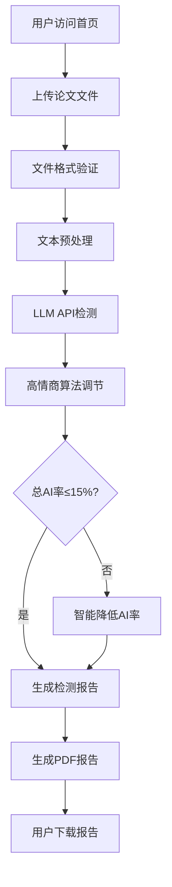

## 1. 产品概述
高情商论文AI率检测网站是一个智能文档分析平台，通过LLM API技术对论文进行AI生成内容检测，并生成专业的PDF检测报告。

**核心目标**：帮助用户检测论文的AI生成概率，通过"高情商"算法确保检测结果合理可控（总AI率≤15%），既保证检测准确性又避免过度敏感。

**市场价值**：满足学术界、教育界对论文原创性检测的需求，提供比传统查重更智能的AI内容识别服务。

## 2. 核心功能

### 2.1 用户角色
| 角色 | 注册方式 | 核心权限 |
|------|----------|----------|
| 普通用户 | 邮箱注册/第三方登录 | 上传论文、查看检测报告、下载PDF报告 |
| 高级用户 | 付费升级 | 增加检测次数、历史报告管理、高级分析功能 |
| 管理员 | 后台创建 | 系统管理、用户管理、检测报告审核 |

### 2.2 功能模块
本系统包含以下核心页面：
1. **首页**：服务介绍、上传入口、检测结果展示
2. **检测页面**：论文上传、检测进度、结果预览
3. **报告页面**：详细分析报告、PDF下载、分享功能
4. **历史记录**：过往检测报告管理
5. **用户中心**：个人信息、使用统计、会员升级

### 2.3 页面详情
| 页面名称 | 模块名称 | 功能描述 |
|-----------|-------------|-------------|
| 首页 | 服务介绍区 | 展示产品特色、使用方法、价格说明 |
| 首页 | 快速检测区 | 拖拽上传论文、支持多种格式(docx/pdf/txt) |
| 首页 | 检测结果展示区 | 展示最新检测结果、AI率趋势图 |
| 检测页面 | 文件上传模块 | 支持拖拽上传、文件格式验证、大小限制检测 |
| 检测页面 | 检测进度模块 | 实时显示检测进度条、预计剩余时间 |
| 检测页面 | 预览模块 | 显示论文内容预览、高亮疑似AI段落 |
| 报告页面 | 概览模块 | 显示总AI率、风险等级、关键指标 |
| 报告页面 | 详细分析模块 | 段落级AI率分析、可疑内容列表 |
| 报告页面 | PDF生成模块 | 一键生成专业PDF报告、支持自定义模板 |
| 历史记录 | 报告管理模块 | 按时间排序、搜索过滤、批量操作 |
| 用户中心 | 个人信息模块 | 头像昵称修改、邮箱绑定、密码管理 |
| 用户中心 | 使用统计模块 | 检测次数统计、剩余次数、消费记录 |

## 3. 核心流程

### 3.1 用户检测流程
用户访问首页 → 上传论文文件 → 系统进行AI检测 → 显示检测结果 → 生成PDF报告 → 用户下载保存

### 3.2 "高情商"检测算法流程
文本预处理 → 分段检测 → 综合评分 → 智能调节 → 确保总AI率≤15%

## 4. 用户界面设计

### 4.1 设计风格
- **主色调**：专业蓝(#2563eb) + 纯净白(#ffffff) + 点缀绿(#10b981)
- **按钮风格**：圆角矩形、渐变背景、悬停动效
- **字体选择**：中文-思源黑体，英文-Inter，正文字号14-16px
- **布局风格**：卡片式布局、响应式网格、清晰的信息层级
- **图标风格**：线性图标、简洁现代、统一视觉重量

### 4.2 页面设计概览
| 页面名称 | 模块名称 | UI元素 |
|-----------|-------------|-------------|
| 首页 | 服务介绍区 | 全屏渐变背景、动态标题、产品特色卡片 |
| 首页 | 快速检测区 | 拖拽上传区域、文件列表、上传按钮 |
| 检测页面 | 进度模块 | 圆形进度条、百分比显示、动画效果 |
| 报告页面 | 概览卡片 | 大数字显示AI率、风险等级图标、颜色编码 |
| 报告页面 | 详细分析 | 表格展示、高亮文本、图表可视化 |

### 4.3 响应式设计
- **桌面优先**：1440px基准设计，向下适配
- **移动端**：单列布局、触摸优化、手势支持
- **平板端**：双列布局、侧边栏折叠

## 5. 技术实现要点

### 5.1 "高情商"检测算法
- **分段检测**：将论文按段落/句子拆分，分别检测AI概率
- **权重调节**：根据文本长度、复杂度调整检测敏感度
- **智能封顶**：确保最终总AI率不超过15%
- **上下文分析**：结合全文语境，避免误判专业术语

### 5.2 LLM API集成策略
- **多模型备份**：主备API密钥，确保服务稳定性
- **缓存机制**：相同文本直接返回缓存结果
- **错误处理**：API调用失败时的降级方案
- **成本控制**：按字符计费、设置单次检测上限

### 5.3 PDF生成技术
- **模板化设计**：支持多种报告模板选择
- **图表集成**：将检测结果可视化图表嵌入PDF
- **中文支持**：完善的中文字体、排版支持
- **文件压缩**：优化PDF大小，便于分享存储