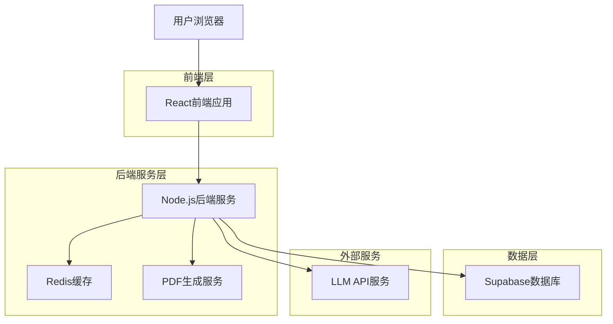
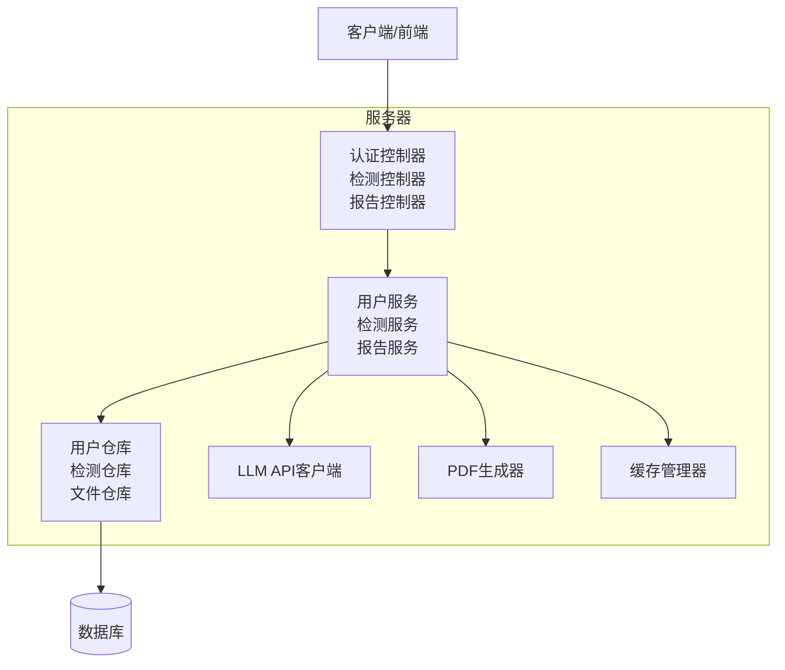
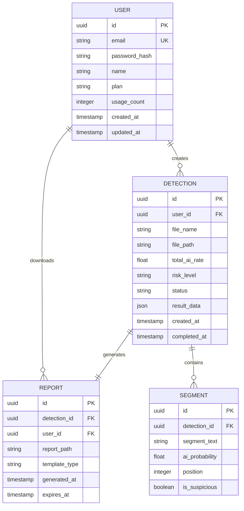

## 1. 架构设计



## 2. 技术描述

- **前端**：React@18 + TypeScript + TailwindCSS@3 + Vite
- **初始化工具**：vite-init
- **后端**：Node.js + Express@4 + TypeScript
- **数据库**：Supabase (PostgreSQL)
- **缓存**：Redis
- **文件存储**：Supabase Storage
- **PDF生成**：Puppeteer + PDFKit

## 3. 路由定义

| 路由 | 用途 |
|-------|---------|
| / | 首页，服务介绍和快速检测入口 |
| /detect | 检测页面，文件上传和进度显示 |
| /report/:id | 报告页面，显示详细检测结果 |
| /history | 历史记录，过往检测报告列表 |
| /profile | 用户中心，个人信息和设置 |
| /login | 登录页面，用户身份验证 |
| /register | 注册页面，新用户注册 |

## 4. API定义

### 4.1 核心API

#### 文件上传
```
POST /api/upload
```

请求：
| 参数名 | 参数类型 | 是否必需 | 描述 |
|-----------|-------------|-------------|-------------|
| file | File | 是 | 论文文件 |
| userId | string | 是 | 用户ID |

响应：
| 参数名 | 参数类型 | 描述 |
|-----------|-------------|-------------|
| fileId | string | 文件唯一标识 |
| status | string | 上传状态 |

#### 开始检测
```
POST /api/detect/start
```

请求：
| 参数名 | 参数类型 | 是否必需 | 描述 |
|-----------|-------------|-------------|-------------|
| fileId | string | 是 | 文件ID |
| userId | string | 是 | 用户ID |

响应：
| 参数名 | 参数类型 | 描述 |
|-----------|-------------|-------------|
| detectId | string | 检测任务ID |
| status | string | 任务状态 |

#### 获取检测结果
```
GET /api/detect/result/:detectId
```

响应：
| 参数名 | 参数类型 | 描述 |
|-----------|-------------|-------------|
| aiRate | number | AI率百分比 |
| riskLevel | string | 风险等级 |
| segments | array | 分段检测结果 |
| summary | object | 检测摘要 |

#### 生成PDF报告
```
POST /api/report/generate
```

请求：
| 参数名 | 参数类型 | 是否必需 | 描述 |
|-----------|-------------|-------------|-------------|
| detectId | string | 是 | 检测任务ID |
| template | string | 否 | 报告模板类型 |

响应：
| 参数名 | 参数类型 | 描述 |
|-----------|-------------|-------------|
| reportUrl | string | PDF报告下载链接 |
| expiresAt | string | 链接过期时间 |

## 5. 服务器架构图



## 6. 数据模型

### 6.1 数据模型定义



### 6.2 数据定义语言

#### 用户表 (users)
```sql
-- 创建表
CREATE TABLE users (
    id UUID PRIMARY KEY DEFAULT gen_random_uuid(),
    email VARCHAR(255) UNIQUE NOT NULL,
    password_hash VARCHAR(255) NOT NULL,
    name VARCHAR(100) NOT NULL,
    plan VARCHAR(20) DEFAULT 'free' CHECK (plan IN ('free', 'premium', 'enterprise')),
    usage_count INTEGER DEFAULT 0,
    max_usage INTEGER DEFAULT 3,
    created_at TIMESTAMP WITH TIME ZONE DEFAULT NOW(),
    updated_at TIMESTAMP WITH TIME ZONE DEFAULT NOW()
);

-- 创建索引
CREATE INDEX idx_users_email ON users(email);
CREATE INDEX idx_users_plan ON users(plan);
```

#### 检测记录表 (detections)
```sql
-- 创建表
CREATE TABLE detections (
    id UUID PRIMARY KEY DEFAULT gen_random_uuid(),
    user_id UUID REFERENCES users(id) ON DELETE CASCADE,
    file_name VARCHAR(255) NOT NULL,
    file_path VARCHAR(500) NOT NULL,
    file_size INTEGER NOT NULL,
    total_ai_rate DECIMAL(5,2) DEFAULT 0.00,
    risk_level VARCHAR(20) CHECK (risk_level IN ('low', 'medium', 'high')),
    status VARCHAR(20) DEFAULT 'pending' CHECK (status IN ('pending', 'processing', 'completed', 'failed')),
    result_data JSONB,
    error_message TEXT,
    processing_time INTEGER,
    created_at TIMESTAMP WITH TIME ZONE DEFAULT NOW(),
    completed_at TIMESTAMP WITH TIME ZONE
);

-- 创建索引
CREATE INDEX idx_detections_user_id ON detections(user_id);
CREATE INDEX idx_detections_status ON detections(status);
CREATE INDEX idx_detections_created_at ON detections(created_at DESC);
```

#### 分段检测表 (segments)
```sql
-- 创建表
CREATE TABLE segments (
    id UUID PRIMARY KEY DEFAULT gen_random_uuid(),
    detection_id UUID REFERENCES detections(id) ON DELETE CASCADE,
    segment_text TEXT NOT NULL,
    ai_probability DECIMAL(5,2) NOT NULL,
    position INTEGER NOT NULL,
    is_suspicious BOOLEAN DEFAULT FALSE,
    created_at TIMESTAMP WITH TIME ZONE DEFAULT NOW()
);

-- 创建索引
CREATE INDEX idx_segments_detection_id ON segments(detection_id);
CREATE INDEX idx_segments_position ON segments(position);
```

#### 报告表 (reports)
```sql
-- 创建表
CREATE TABLE reports (
    id UUID PRIMARY KEY DEFAULT gen_random_uuid(),
    detection_id UUID REFERENCES detections(id) ON DELETE CASCADE,
    user_id UUID REFERENCES users(id) ON DELETE CASCADE,
    report_path VARCHAR(500) NOT NULL,
    template_type VARCHAR(50) DEFAULT 'standard',
    download_count INTEGER DEFAULT 0,
    generated_at TIMESTAMP WITH TIME ZONE DEFAULT NOW(),
    expires_at TIMESTAMP WITH TIME ZONE
);

-- 创建索引
CREATE INDEX idx_reports_detection_id ON reports(detection_id);
CREATE INDEX idx_reports_user_id ON reports(user_id);
CREATE INDEX idx_reports_expires_at ON reports(expires_at);
```

### 6.3 权限设置
```sql
-- 基本权限设置
GRANT SELECT ON users TO anon;
GRANT ALL PRIVILEGES ON users TO authenticated;

GRANT SELECT ON detections TO anon;
GRANT ALL PRIVILEGES ON detections TO authenticated;

GRANT SELECT ON segments TO anon;
GRANT ALL PRIVILEGES ON segments TO authenticated;

GRANT SELECT ON reports TO anon;
GRANT ALL PRIVILEGES ON reports TO authenticated;
```

## 7. "高情商"检测算法实现

### 7.1 核心算法逻辑
```typescript
interface DetectionOptions {
  maxAiRate: number; // 最大AI率，默认15%
  sensitivity: number; // 敏感度，影响调节力度
  contextWeight: number; // 上下文权重
}

class SmartDetectionService {
  async detectWithEmotionalIntelligence(
    text: string, 
    options: DetectionOptions = { maxAiRate: 15, sensitivity: 0.8, contextWeight: 0.3 }
  ): Promise<DetectionResult> {
    // 1. 文本分段
    const segments = this.segmentText(text);
    
    // 2. 初步检测
    const rawResults = await this.llmDetect(segments);
    
    // 3. 智能调节
    const adjustedResults = this.adjustResults(rawResults, options);
    
    // 4. 确保总AI率不超过阈值
    const finalResults = this.ensureMaxAiRate(adjustedResults, options.maxAiRate);
    
    return finalResults;
  }
  
  private adjustResults(results: SegmentResult[], options: DetectionOptions): SegmentResult[] {
    return results.map(result => {
      // 根据文本特征调整AI概率
      const features = this.extractFeatures(result.text);
      const adjustment = this.calculateAdjustment(features, options);
      
      return {
        ...result,
        aiProbability: Math.max(0, Math.min(100, result.aiProbability + adjustment)),
        adjustmentReason: this.getAdjustmentReason(features)
      };
    });
  }
}
```

### 7.2 调节策略
- **学术术语保护**：降低专业术语的AI检测敏感度
- **引用内容识别**：排除正确引用的内容
- **格式特征分析**：考虑论文格式对检测的影响
- **上下文一致性**：基于全文语境调整局部检测结果