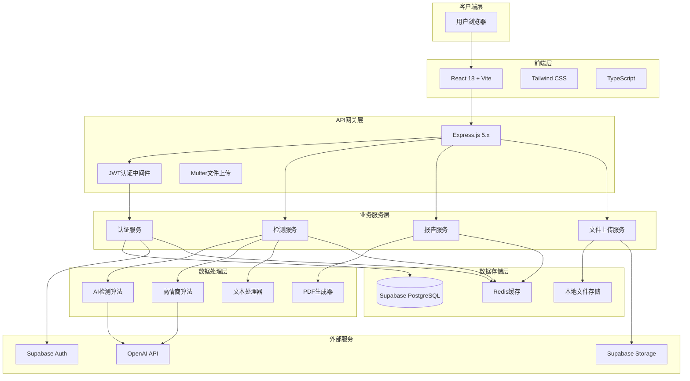
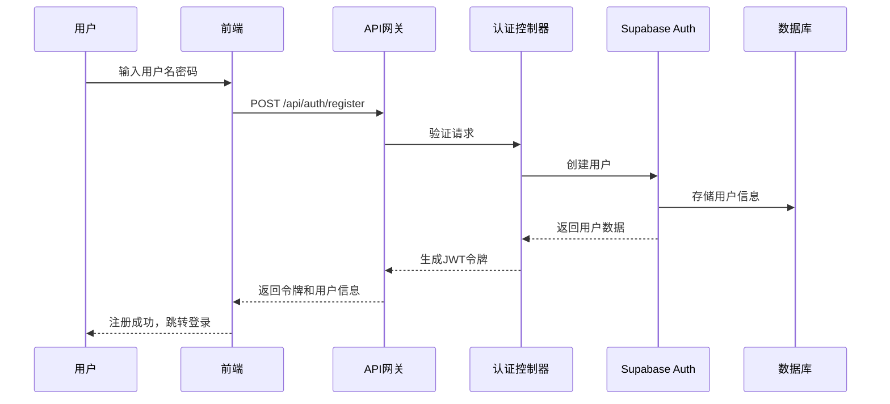
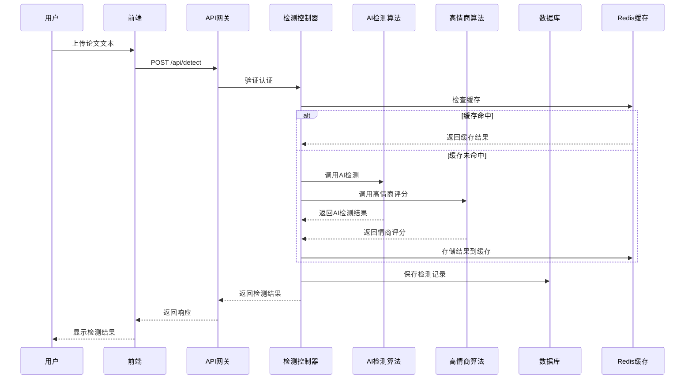
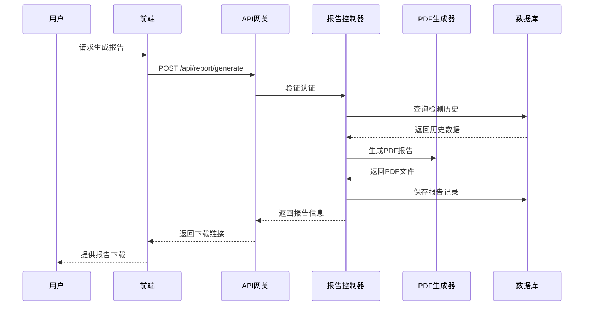
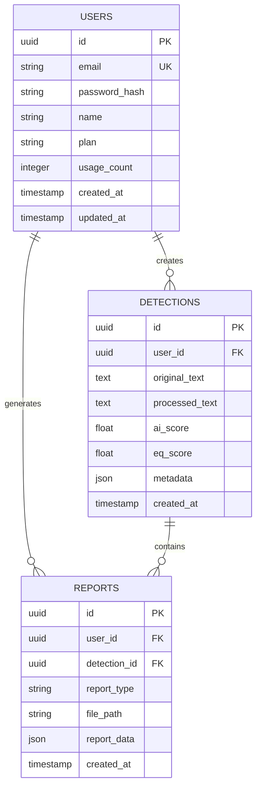

# 系统技术架构详细说明

## 1. 系统整体架构图及分层设计

### 1.1 架构概览



### 1.2 分层架构说明

#### 表现层（Presentation Layer）
- **位置**：`src/` 目录下的 React 应用
- **职责**：用户界面渲染、交互逻辑、状态管理
- **技术栈**：React 18、TypeScript、Tailwind CSS、Vite

#### API网关层（API Gateway Layer）
- **位置**：`api/` 目录下的 Express 应用
- **职责**：请求路由、认证授权、文件处理、错误处理
- **技术栈**：Express.js 5.x、Multer、JWT、CORS

#### 业务逻辑层（Business Logic Layer）
- **位置**：`api/controllers/` 和 `api/services/`
- **职责**：核心业务逻辑处理、AI检测算法、报告生成
- **模块**：
  - 认证控制器（`auth.ts`）
  - 检测控制器（`detect.ts`）
  - 报告控制器（`report.ts`）
  - 上传控制器（`upload.ts`）

#### 数据处理层（Data Processing Layer）
- **位置**：`api/utils/`
- **职责**：AI内容检测、高情商算法、文本处理、PDF生成
- **核心算法**：
  - `aiDetector.ts`：AI生成内容检测
  - `highEQAlgorithm.ts`：高情商评分算法
  - `textProcessor.ts`：文本预处理

#### 数据访问层（Data Access Layer）
- **位置**：`api/lib/`
- **职责**：数据库连接、缓存管理、文件存储
- **组件**：
  - `supabase.ts`：PostgreSQL数据库连接
  - `redis.ts`：Redis缓存管理

## 2. 核心技术栈和框架版本

### 2.1 前端技术栈
| 技术 | 版本 | 用途 |
|------|------|------|
| React | 18.x | UI框架 |
| TypeScript | 5.x | 类型安全 |
| Vite | 5.x | 构建工具 |
| Tailwind CSS | 3.x | 样式框架 |
| Axios | 1.x | HTTP客户端 |
| Zustand | 4.x | 状态管理 |
| React Router | 6.x | 路由管理 |

### 2.2 后端技术栈
| 技术 | 版本 | 用途 |
|------|------|------|
| Node.js | 22.x | 运行时环境 |
| Express.js | 5.x | Web框架 |
| TypeScript | 5.x | 类型安全 |
| Multer | 1.x | 文件上传处理 |
| JWT | 9.x | 认证授权 |
| Bcrypt | 5.x | 密码加密 |
| Cors | 2.x | 跨域处理 |

### 2.3 数据库和存储
| 技术 | 版本 | 用途 |
|------|------|------|
| Supabase | 最新 | BaaS平台 |
| PostgreSQL | 15.x | 关系型数据库 |
| Redis | 7.x | 缓存和会话存储 |
| 本地文件系统 | - | 临时文件存储 |

### 2.4 外部服务
| 服务 | 用途 |
|------|------|
| OpenAI API | AI内容检测 |
| Supabase Auth | 用户认证 |
| Supabase Storage | 文件存储 |

## 3. 基础设施和部署环境

### 3.1 开发环境
- **本地开发**：支持热重载和实时编译
- **前端开发服务器**：Vite dev server（端口5173）
- **后端开发服务器**：Nodemon（端口3001）
- **预览环境**：Vite preview（端口4173）

### 3.2 容器化支持
```dockerfile
# Dockerfile
FROM node:22-alpine
WORKDIR /app
COPY package*.json ./
RUN npm ci --only=production
COPY . .
EXPOSE 3001
CMD ["npm", "run", "start"]
```

### 3.3 Docker Compose配置
```yaml
# docker-compose.yml
version: '3.8'
services:
  app:
    build: .
    ports:
      - "3001:3001"
    environment:
      - NODE_ENV=production
      - SUPABASE_URL=${SUPABASE_URL}
      - SUPABASE_ANON_KEY=${SUPABASE_ANON_KEY}
      - SUPABASE_SERVICE_ROLE_KEY=${SUPABASE_SERVICE_ROLE_KEY}
      - JWT_SECRET=${JWT_SECRET}
      - OPENAI_API_KEY=${OPENAI_API_KEY}
      - REDIS_URL=${REDIS_URL}
    depends_on:
      - redis
  
  redis:
    image: redis:7-alpine
    ports:
      - "6379:6379"
```

### 3.4 部署选项
- **Vercel**：支持前端和后端一体化部署
- **Docker**：支持容器化部署
- **传统服务器**：支持Node.js环境部署

## 4. 关键组件和模块的交互流程

### 4.1 用户认证流程


### 4.2 AI检测流程


### 4.3 报告生成流程


## 5. 数据存储方案和数据库选型

### 5.1 数据库设计


### 5.2 数据表结构

#### 用户表（users）
```sql
CREATE TABLE users (
    id UUID PRIMARY KEY DEFAULT gen_random_uuid(),
    email VARCHAR(255) UNIQUE NOT NULL,
    password_hash VARCHAR(255) NOT NULL,
    name VARCHAR(100) NOT NULL,
    plan VARCHAR(20) DEFAULT 'free' CHECK (plan IN ('free', 'premium')),
    usage_count INTEGER DEFAULT 0,
    created_at TIMESTAMP WITH TIME ZONE DEFAULT NOW(),
    updated_at TIMESTAMP WITH TIME ZONE DEFAULT NOW()
);
```

#### 检测记录表（detections）
```sql
CREATE TABLE detections (
    id UUID PRIMARY KEY DEFAULT gen_random_uuid(),
    user_id UUID REFERENCES users(id) ON DELETE CASCADE,
    original_text TEXT NOT NULL,
    processed_text TEXT,
    ai_score FLOAT,
    eq_score FLOAT,
    metadata JSONB,
    created_at TIMESTAMP WITH TIME ZONE DEFAULT NOW()
);
```

#### 报告表（reports）
```sql
CREATE TABLE reports (
    id UUID PRIMARY KEY DEFAULT gen_random_uuid(),
    user_id UUID REFERENCES users(id) ON DELETE CASCADE,
    detection_id UUID REFERENCES detections(id) ON DELETE CASCADE,
    report_type VARCHAR(50) NOT NULL,
    file_path VARCHAR(500),
    report_data JSONB,
    created_at TIMESTAMP WITH TIME ZONE DEFAULT NOW()
);
```

### 5.3 缓存策略
- **Redis缓存**：用于存储频繁访问的检测结果
- **缓存键格式**：`detection:{user_id}:{text_hash}`
- **缓存过期时间**：24小时
- **缓存更新策略**：写后删除（Write-through with invalidation）

## 6. 系统间的集成方式和接口规范

### 6.1 RESTful API设计

#### 认证相关API
| 方法 | 路径 | 描述 |
|------|------|------|
| POST | /api/auth/register | 用户注册 |
| POST | /api/auth/login | 用户登录 |
| POST | /api/auth/logout | 用户登出 |
| GET | /api/auth/profile | 获取用户信息 |
| PUT | /api/auth/profile | 更新用户信息 |

#### 检测相关API
| 方法 | 路径 | 描述 |
|------|------|------|
| POST | /api/detect | AI内容检测 |
| GET | /api/detect/history | 获取检测历史 |
| GET | /api/detect/:id | 获取检测详情 |
| DELETE | /api/detect/:id | 删除检测记录 |

#### 报告相关API
| 方法 | 路径 | 描述 |
|------|------|------|
| POST | /api/report/generate | 生成PDF报告 |
| GET | /api/report/list | 获取报告列表 |
| GET | /api/report/:id/download | 下载报告 |
| DELETE | /api/report/:id | 删除报告 |

#### 文件上传API
| 方法 | 路径 | 描述 |
|------|------|------|
| POST | /api/upload | 上传文件 |
| GET | /api/upload/:filename | 获取文件 |
| DELETE | /api/upload/:filename | 删除文件 |

### 6.2 接口规范

#### 请求格式
- **Content-Type**：`application/json`
- **认证方式**：Bearer Token（JWT）
- **字符编码**：UTF-8

#### 响应格式
```json
{
  "success": true,
  "data": {},
  "message": "操作成功",
  "timestamp": "2024-01-01T00:00:00.000Z"
}
```

#### 错误响应格式
```json
{
  "success": false,
  "error": {
    "code": "VALIDATION_ERROR",
    "message": "请求参数验证失败",
    "details": []
  },
  "timestamp": "2024-01-01T00:00:00.000Z"
}
```

### 6.3 认证机制
- **JWT令牌**：包含用户ID、角色、过期时间
- **令牌有效期**：7天
- **刷新机制**：支持令牌刷新
- **权限控制**：基于角色的访问控制（RBAC）

## 7. 当前架构的优势和已知的局限性

### 7.1 架构优势

#### 7.1.1 技术先进性
- **现代化前端**：React 18 + TypeScript + Vite，开发体验优秀
- **服务端渲染**：支持SSR，SEO友好
- **类型安全**：全栈TypeScript，减少运行时错误
- **现代化CSS**：Tailwind CSS，快速样式开发

#### 7.1.2 架构灵活性
- **前后端分离**：独立部署，技术栈解耦
- **微服务友好**：易于拆分为独立服务
- **云原生**：支持容器化部署和弹性伸缩
- **多云支持**：不依赖特定云服务商

#### 7.1.3 开发效率
- **热重载**：前后端都支持热重载，开发效率高
- **类型提示**：IDE智能提示，减少开发错误
- **自动化测试**：易于编写单元测试和集成测试
- **CI/CD友好**：支持自动化部署流程

#### 7.1.4 性能优化
- **缓存策略**：Redis缓存减少重复计算
- **CDN支持**：静态资源CDN加速
- **代码分割**：Webpack/Vite自动代码分割
- **图片优化**：支持WebP格式和懒加载

#### 7.1.5 安全性
- **JWT认证**：无状态认证，支持分布式部署
- **HTTPS支持**：全站HTTPS加密
- **CORS配置**：跨域安全配置
- **输入验证**：请求参数严格验证
- **SQL注入防护**：使用ORM和参数化查询

### 7.2 已知局限性

#### 7.2.1 性能瓶颈
- **AI检测延迟**：依赖OpenAI API，网络延迟不可控
- **文件上传限制**：大文件上传可能超时
- **并发处理**：单线程Node.js，CPU密集型任务性能有限
- **数据库连接**：高并发下数据库连接池可能成为瓶颈

#### 7.2.2 扩展性限制
- **单体架构**：当前为单体应用，扩展性有限
- **状态管理**：部分状态存储在内存中，不利于水平扩展
- **文件存储**：本地文件存储，不利于分布式部署
- **缓存一致性**：Redis缓存与数据库一致性需要额外处理

#### 7.2.3 运维复杂性
- **多服务依赖**：需要维护PostgreSQL、Redis、Node.js等多个服务
- **环境配置**：开发、测试、生产环境配置复杂
- **监控告警**：缺乏完善的监控和告警机制
- **日志管理**：日志分散，不利于问题排查

#### 7.2.4 成本控制
- **OpenAI API费用**：AI检测依赖外部API，成本较高
- **云服务商费用**：使用Supabase等云服务，长期成本需要考虑
- **Redis成本**：内存数据库成本相对较高
- **CDN费用**：如果使用CDN加速，会产生额外费用

#### 7.2.5 技术债务
- **依赖更新**：需要定期更新依赖包，避免安全漏洞
- **代码重构**：部分代码结构需要优化，提高可维护性
- **测试覆盖**：测试覆盖率有待提高
- **文档完善**：API文档和架构文档需要持续更新

### 7.3 改进建议

#### 7.3.1 架构优化
- **微服务化**：将核心功能拆分为独立微服务
- **事件驱动**：引入消息队列，实现异步处理
- **服务网格**：使用Istio等服务网格技术
- **Serverless**：考虑将部分功能迁移到Serverless平台

#### 7.3.2 性能提升
- **缓存优化**：实现多级缓存策略
- **CDN集成**：集成CDN加速静态资源
- **数据库优化**：添加索引、分区等优化措施
- **负载均衡**：实现应用层负载均衡

#### 7.3.3 监控运维
- **APM集成**：集成应用性能监控
- **日志聚合**：使用ELK等日志聚合方案
- **自动化测试**：完善CI/CD流程
- **健康检查**：实现服务健康检查机制

#### 7.3.4 安全加固
- **WAF防护**：集成Web应用防火墙
- **DDoS防护**：实现DDoS攻击防护
- **数据加密**：敏感数据加密存储
- **安全审计**：实现安全审计日志

通过持续的架构优化和技术升级，可以逐步解决当前存在的局限性，构建更加稳定、高效、安全的系统架构。