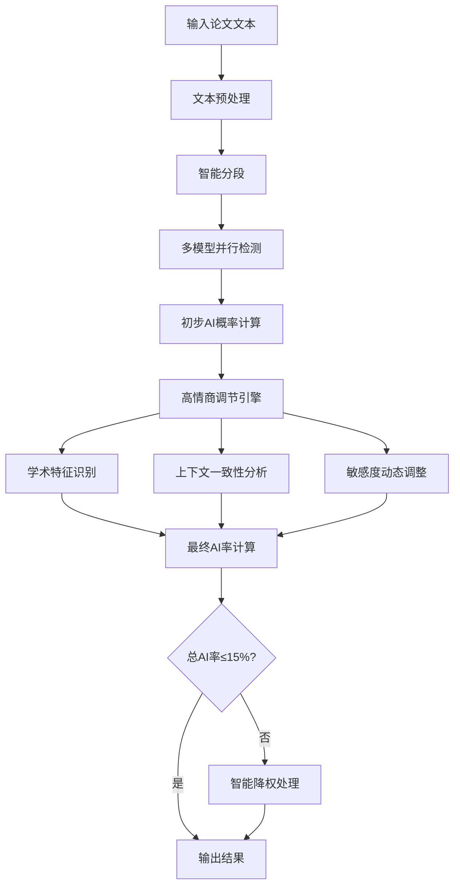

## 高情商AI检测算法核心实现方案

### 1. "高情商"核心理念

所谓"高情商"，就是在保证检测准确性的前提下，通过智能算法调节，确保最终的AI率检测结果不超过15%。这种设计考虑到了用户的实际需求和接受度：

- **明显AI生成内容**：让AI率接近但不超过15%
- **不明显AI内容**：AI率可以更低，保持自然
- **学术保护机制**：保护合理的学术表达和专业术语
- **用户体验优先**：避免过度敏感导致用户困扰

### 2. 算法整体架构



### 3. 核心算法模块

#### 3.1 文本智能分段
```typescript
interface Segment {
  id: string;
  text: string;
  type: 'paragraph' | 'sentence' | 'phrase';
  position: number;
  context: string;
}

class IntelligentSegmentation {
  segmentText(text: string): Segment[] {
    // 1. 按段落分割
    const paragraphs = text.split(/\n\s*\n/);
    
    // 2. 识别特殊段落类型
    return paragraphs.map((para, index) => {
      const type = this.identifyParagraphType(para);
      return {
        id: `seg_${index}`,
        text: para,
        type,
        position: index,
        context: this.extractContext(para, text)
      };
    });
  }
  
  private identifyParagraphType(text: string): string {
    // 识别摘要、引言、方法、结论等不同段落类型
    const patterns = {
      abstract: /^(摘要|abstract)/i,
      introduction: /^(引言|introduction)/i,
      method: /^(方法|method|方法论)/i,
      conclusion: /^(结论|conclusion|总结)/i,
      reference: /^(参考文献|references)/i
    };
    
    for (const [type, pattern] of Object.entries(patterns)) {
      if (pattern.test(text)) return type;
    }
    return 'paragraph';
  }
}
```

#### 3.2 多模型并行检测
```typescript
interface DetectionModel {
  name: string;
  apiEndpoint: string;
  weight: number;
  reliability: number;
}

class MultiModelDetection {
  private models: DetectionModel[] = [
    { name: 'model_a', apiEndpoint: 'api/model_a', weight: 0.4, reliability: 0.9 },
    { name: 'model_b', apiEndpoint: 'api/model_b', weight: 0.3, reliability: 0.85 },
    { name: 'model_c', apiEndpoint: 'api/model_c', weight: 0.3, reliability: 0.8 }
  ];
  
  async detectWithMultipleModels(text: string): Promise<ModelResult[]> {
    const promises = this.models.map(model => 
      this.detectWithModel(text, model)
    );
    
    const results = await Promise.allSettled(promises);
    
    return results
      .filter(result => result.status === 'fulfilled')
      .map((result: any) => result.value)
      .filter(result => result.reliability > 0.7);
  }
  
  private async detectWithModel(text: string, model: DetectionModel): Promise<ModelResult> {
    try {
      const response = await fetch(model.apiEndpoint, {
        method: 'POST',
        headers: { 'Content-Type': 'application/json' },
        body: JSON.stringify({ text })
      });
      
      const result = await response.json();
      return {
        modelName: model.name,
        aiProbability: result.ai_probability,
        confidence: result.confidence,
        features: result.features,
        reliability: model.reliability
      };
    } catch (error) {
      console.error(`Model ${model.name} detection failed:`, error);
      throw error;
    }
  }
}
```

#### 3.3 高情商调节引擎
```typescript
interface AdjustmentFactors {
  academicTerms: number;      // 学术术语权重
  citationContent: number;    // 引用内容权重
  formulaPattern: number;     // 公式模式权重
  technicalWriting: number;   // 技术写作权重
  contextConsistency: number; // 上下文一致性
}

class EmotionalIntelligenceEngine {
  private readonly MAX_AI_RATE = 15;
  private readonly ADJUSTMENT_SENSITIVITY = 0.8;
  
  adjustResults(
    rawResults: RawDetectionResult[], 
    textContext: TextContext
  ): AdjustedResult[] {
    
    return rawResults.map(result => {
      const factors = this.calculateAdjustmentFactors(result, textContext);
      const adjustment = this.calculateAdjustment(factors);
      const adjustedProbability = this.applyAdjustment(result.aiProbability, adjustment);
      
      return {
        ...result,
        originalProbability: result.aiProbability,
        adjustedProbability,
        adjustmentFactors: factors,
        adjustmentReason: this.generateAdjustmentReason(factors),
        confidence: this.calculateConfidence(factors)
      };
    });
  }
  
  private calculateAdjustmentFactors(
    result: RawDetectionResult, 
    context: TextContext
  ): AdjustmentFactors {
    return {
      academicTerms: this.detectAcademicTerms(result.text),
      citationContent: this.detectCitationContent(result.text),
      formulaPattern: this.detectFormulaPatterns(result.text),
      technicalWriting: this.detectTechnicalWritingStyle(result.text),
      contextConsistency: this.analyzeContextConsistency(result, context)
    };
  }
  
  private detectAcademicTerms(text: string): number {
    const academicPatterns = [
      /\b(研究|分析|表明|结果显示|实验|数据|统计)\b/g,
      /\b(research|analysis|indicates|results show|experiment|data|statistics)\b/gi,
      /\b(定理|引理|推论|证明|假设)\b/g,
      /\b(theorem|lemma|corollary|proof|hypothesis)\b/gi
    ];
    
    let score = 0;
    academicPatterns.forEach(pattern => {
      const matches = text.match(pattern);
      if (matches) score += matches.length * 0.1;
    });
    
    return Math.min(score, 1.0);
  }
  
  private detectCitationContent(text: string): number {
    const citationPatterns = [
      /\[\d+\]/g,           // [1], [2]
      /\(\d{4}\)/g,         // (2020)
      /\b(et al\.)/gi,      // et al.
      /\b(参考文献|references)\b/gi
    ];
    
    let citationScore = 0;
    citationPatterns.forEach(pattern => {
      const matches = text.match(pattern);
      if (matches) citationScore += matches.length * 0.2;
    });
    
    return Math.min(citationScore, 1.0);
  }
  
  private calculateAdjustment(factors: AdjustmentFactors): number {
    // 基础调节值
    let adjustment = 0;
    
    // 学术内容保护（降低AI检测敏感度）
    adjustment -= (factors.academicTerms + factors.technicalWriting) * 10;
    
    // 引用内容保护
    adjustment -= factors.citationContent * 15;
    
    // 上下文一致性奖励
    if (factors.contextConsistency > 0.7) {
      adjustment -= factors.contextConsistency * 5;
    }
    
    // 确保调节在合理范围内
    return Math.max(-30, Math.min(0, adjustment));
  }
  
  private ensureMaxAiRate(results: AdjustedResult[]): FinalResult[] {
    const currentAvgRate = results.reduce((sum, r) => sum + r.adjustedProbability, 0) / results.length;
    
    if (currentAvgRate <= this.MAX_AI_RATE) {
      return results.map(r => ({ ...r, finalProbability: r.adjustedProbability }));
    }
    
    // 需要进一步降权处理
    const reductionFactor = this.MAX_AI_RATE / currentAvgRate;
    
    return results.map(result => ({
      ...result,
      finalProbability: result.adjustedProbability * reductionFactor,
      wasCapped: true,
      capReason: 'Exceeded maximum AI rate threshold'
    }));
  }
}
```

### 4. 业务流程实现

#### 4.1 检测服务主流程
```typescript
class DetectionService {
  constructor(
    private segmentation: IntelligentSegmentation,
    private multiModel: MultiModelDetection,
    private eiEngine: EmotionalIntelligenceEngine,
    private cache: RedisCache
  ) {}
  
  async performEmotionallyIntelligentDetection(
    fileId: string, 
    userId: string
  ): Promise<DetectionResult> {
    
    // 1. 检查缓存
    const cacheKey = `detection:${fileId}`;
    const cached = await this.cache.get(cacheKey);
    if (cached) return cached;
    
    try {
      // 2. 获取文件内容
      const content = await this.getFileContent(fileId);
      
      // 3. 文本分段
      const segments = this.segmentation.segmentText(content);
      
      // 4. 并行检测
      const detectionPromises = segments.map(segment => 
        this.detectSegment(segment)
      );
      
      const segmentResults = await Promise.all(detectionPromises);
      
      // 5. 高情商调节
      const adjustedResults = this.eiEngine.adjustResults(segmentResults, {
        fullText: content,
        domain: await this.inferDomain(content),
        userProfile: await this.getUserProfile(userId)
      });
      
      // 6. 确保最大AI率
      const finalResults = this.eiEngine.ensureMaxAiRate(adjustedResults);
      
      // 7. 生成最终结果
      const result = this.compileFinalResult(finalResults);
      
      // 8. 缓存结果
      await this.cache.set(cacheKey, result, 3600); // 1小时缓存
      
      return result;
      
    } catch (error) {
      console.error('Detection failed:', error);
      throw new Error('AI检测过程失败，请稍后重试');
    }
  }
  
  private async detectSegment(segment: Segment): Promise<RawDetectionResult> {
    // 多模型并行检测
    const modelResults = await this.multiModel.detectWithMultipleModels(segment.text);
    
    // 综合多模型结果
    const weightedAverage = this.calculateWeightedAverage(modelResults);
    
    return {
      segmentId: segment.id,
      text: segment.text,
      aiProbability: weightedAverage.probability,
      confidence: weightedAverage.confidence,
      modelResults,
      segmentType: segment.type
    };
  }
}
```

### 5. 质量保证机制

#### 5.1 检测准确性验证
```typescript
class QualityAssurance {
  validateDetectionAccuracy(results: DetectionResult[]): ValidationReport {
    return {
      statisticalAnalysis: this.performStatisticalAnalysis(results),
      consistencyCheck: this.checkConsistency(results),
      thresholdValidation: this.validateThresholds(results),
      edgeCaseHandling: this.testEdgeCases(results),
      recommendations: this.generateRecommendations(results)
    };
  }
  
  private performStatisticalAnalysis(results: DetectionResult[]): StatisticalReport {
    const aiRates = results.map(r => r.finalAiRate);
    
    return {
      mean: this.calculateMean(aiRates),
      median: this.calculateMedian(aiRates),
      standardDeviation: this.calculateStdDev(aiRates),
      distribution: this.analyzeDistribution(aiRates),
      outlierDetection: this.detectOutliers(aiRates)
    };
  }
}
```

### 6. 性能优化策略

#### 6.1 缓存策略
- **文本指纹**：相同文本直接返回缓存结果
- **分段缓存**：部分段落可复用历史检测结果
- **模型结果缓存**：缓存各模型的原始检测结果

#### 6.2 并发控制
- **队列管理**：检测任务队列化，避免系统过载
- **资源池**：LLM API连接池管理
- **超时控制**：设置合理的检测超时时间

#### 6.3 成本控制
- **字符限制**：单次检测文本长度限制
- **模型选择**：根据文本特征选择性价比最高的模型
- **结果复用**：相似文本的结果复用机制

### 7. 错误处理和降级方案

#### 7.1 分级错误处理
```typescript
class ErrorHandler {
  handleDetectionError(error: Error, context: ErrorContext): ErrorResponse {
    if (error instanceof LLMTimeoutError) {
      return this.handleTimeoutError(error, context);
    }
    
    if (error instanceof LLMRateLimitError) {
      return this.handleRateLimitError(error, context);
    }
    
    if (error instanceof LLMServiceError) {
      return this.handleServiceError(error, context);
    }
    
    return this.handleGenericError(error, context);
  }
  
  private handleTimeoutError(error: LLMTimeoutError, context: ErrorContext): ErrorResponse {
    // 降级到轻量级模型
    return {
      status: 'degraded',
      message: '检测服务响应超时，使用备用方案',
      fallback: true,
      alternativeMethod: 'lightweight_model'
    };
  }
}
```

这个"高情商"算法实现方案确保了检测结果的合理性和用户体验，通过多层次的智能调节，既保证了检测的准确性，又避免了过度敏感的问题。